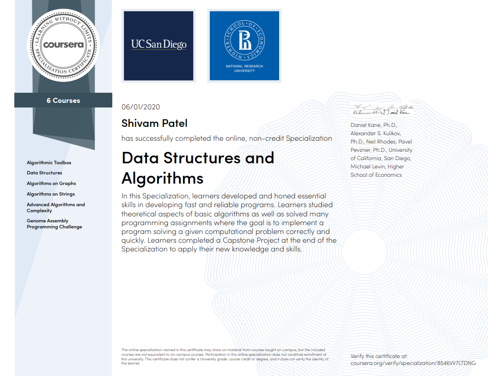

Data Structures and Algorithms Specialization
=============================================

This repository is created to keep track of Data structures and algorithms specialization provided by Coursera.

Table of contents
-----------------

- [Algorithmic Toolbox](https://github.com/shivampatel22/UCSanDiego-data-structures-and-algorithms-specialization/tree/main/C1-algorithmic-toolbox)
- [Data Structures](https://github.com/shivampatel22/UCSanDiego-data-structures-and-algorithms-specialization/tree/main/C2-data-structures)
- [Algorithms on Graphs](https://github.com/shivampatel22/UCSanDiego-data-structures-and-algorithms-specialization/tree/main/C3-algorithms-on-graph)
- [Algorithms on Strings](https://github.com/shivampatel22/UCSanDiego-data-structures-and-algorithms-specialization/tree/main/C4-algorithms-on-strings)
- [Advanced Algorithms and Complexity](https://github.com/shivampatel22/UCSanDiego-data-structures-and-algorithms-specialization/tree/main/C5-advanced-algorithms-and-complexity)
- [Genome Assembly Programming Challenge](https://github.com/shivampatel22/UCSanDiego-data-structures-and-algorithms-specialization/tree/main/C6-genome-assembly-challenge)

Credits
=======

Coursera - https://www.coursera.org/specializations/data-structures-algorithms